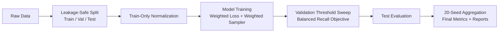

# IoUT Interrogator Framework


IoUT Interrogator Framework is a trust-aware IoUT anomaly inference pipeline with leakage-safe evaluation, class-imbalance controls, and deterministic multi-seed reporting on both synthetic and real network telemetry.

## Table of Contents
- [Highlights](#highlights)
- [Visual Overview](#visual-overview)
- [Datasets](#datasets)
- [Experimental Setup](#experimental-setup)
- [Final Results](#final-results)
- [Reproducibility (Strict, Copy-Paste)](#reproducibility-strict-copy-paste)
- [Installation](#installation)
- [Expected Outputs](#expected-outputs)
- [Configuration](#configuration)
- [Repository Structure](#repository-structure)
- [Citation](#citation)
- [License](#license)

## Highlights
- Leakage-safe protocol: split, scale, and threshold calibration are strictly train/validation scoped.
- Real-data robustness: UNSW-NB15 class-imbalance handling with weighted loss, weighted sampling, and balanced-recall thresholding.
- Reproducible statistics: 20-seed evaluation with mean and standard deviation reporting.
- Reviewer-ready outputs: final summary tables, split checks, confusion matrix, and publication-style report artifacts.

## Visual Overview


## Datasets

### 1) Synthetic Behavioral Dataset
- Purpose: controlled benchmarking across architectures and baselines.
- Pipeline target: multi-model 20-seed robustness summary.

### 2) Real Dataset: UNSW-NB15
- Purpose: external validity under realistic imbalance.
- Required local path:
  - `data/raw/unsw_nb15/Training and Testing Sets/`
- Required files (CSV): UNSW-NB15 training/testing set files.

## Experimental Setup
- Seeds: 42-61 (20 runs)
- All experiments use fixed seeds (42-61) for reproducibility.
- Splits: train 70%, validation 15%, test 15%
- Threshold tuning: validation-only sweep over 0.45 to 0.75 using balanced recall
- Imbalance controls:
  - alpha-scaled BCEWithLogitsLoss (alpha = 0.7)
  - weighted sampler with inverse-frequency exponent
- Key constraints enforced:
  - no test-time tuning
  - no leakage
  - no synthetic oversampling on real data

## Final Results

Only final artifacts are reported below.

### Synthetic (20 seeds)
Source: `results/synthetic_final/summary.csv`

| Model | F1 (mean +/- std) | ROC-AUC (mean +/- std) | PR-AUC (mean +/- std) | Balanced Accuracy (mean +/- std) |
| --- | --- | --- | --- | --- |
| hybrid_temporal | 0.7851 +/- 0.0594 | 0.9637 +/- 0.0089 | 0.8851 +/- 0.0199 | 0.8514 +/- 0.0437 |
| random_forest | 0.7081 +/- 0.0404 | 0.9003 +/- 0.0124 | 0.8088 +/- 0.0222 | 0.7870 +/- 0.0257 |
| logistic_regression | 0.6667 +/- 0.0000 | 0.8638 +/- 0.0000 | 0.7572 +/- 0.0000 | 0.7758 +/- 0.0000 |
| lstm | 0.6444 +/- 0.0403 | 0.8199 +/- 0.0422 | 0.6973 +/- 0.0345 | 0.7513 +/- 0.0216 |

### Real (UNSW-NB15, balanced final, 20 seeds)
Source: `results/unsw_final_balanced/summary.csv`

| Metric | Mean +/- Std |
| --- | --- |
| F1 | 0.8910 +/- 0.0026 |
| ROC-AUC | 0.9251 +/- 0.0199 |
| PR-AUC | 0.9254 +/- 0.0298 |
| Balanced Accuracy | 0.8397 +/- 0.0041 |
| Recall (Class 0) | 0.6961 +/- 0.0075 |
| Recall (Class 1) | 0.9834 +/- 0.0022 |

## Reproducibility (Strict, Copy-Paste)

### 0) System Requirements
- OS: Linux, macOS, or Windows (PowerShell supported)
- Python: 3.10+
- Optional: CUDA-enabled GPU (training also works on CPU)

### 1) Clone and Environment Setup
```bash
git clone https://github.com/aliakarma/IoUT-Interrogator-Framework.git
cd IoUT-Interrogator-Framework
python -m venv .venv
```

Windows PowerShell:
```powershell
.\.venv\Scripts\Activate.ps1
pip install --upgrade pip
pip install -r requirements.txt
```

Linux/macOS:
```bash
source .venv/bin/activate
pip install --upgrade pip
pip install -r requirements.txt
```

### 2) Data Preparation
Place UNSW-NB15 CSV files in:
```text
data/raw/unsw_nb15/Training and Testing Sets/
```

### 3) Reproduce Final Synthetic 20-Seed Benchmark
```bash
python scripts/run_multi_seed_experiments.py \
  --dataset synthetic \
  --seeds 42-61
```

### 4) Reproduce Final UNSW 20-Seed Balanced Evaluation
```bash
python run_unsw_publication_pipeline.py --seeds 42-61
```

Quick verification (one-line):
```bash
python run_unsw_publication_pipeline.py --quick-test
```

### 5) Validate Final Outputs
```bash
python -c "import pandas as pd; print(pd.read_csv('results/synthetic_final/summary.csv'))"
python -c "import pandas as pd; print(pd.read_csv('results/unsw_final_balanced/summary.csv'))"
python -c "import json; print(json.load(open('results/unsw_final_balanced/validation_checks.json')))"
```

## Installation

<details>
<summary>Dependency Notes</summary>

- Core stack: PyTorch, NumPy, pandas, scikit-learn, SciPy, matplotlib.
- Install from:
  - `requirements.txt`
- For CUDA, install the CUDA-compatible PyTorch build for your platform, then run the same commands above.

</details>

## Expected Outputs
```text
results/
  synthetic_final/
  unsw_final_balanced/
```

Primary entry points:
- `run_pipeline.py`
- `run_unsw_publication_pipeline.py`

## Configuration
- Primary config file: `configs/default.yaml`
- Main configurable groups:
  - `data`: dataset source/path, split strategy, loader settings
  - `model`: architecture type and dimensions
  - `training`: epochs, learning rate, loss settings, seed
  - `evaluation`: threshold, tuning metric, confusion-matrix export

## Repository Structure
```text
IoUT-Interrogator-Framework/
├── configs/          # Experiment and model configuration files
├── data/             # Data loaders, adapters, and dataset docs
├── docs/             # Methodology, changelog, and reproducibility notes
├── scripts/          # Reproducible experiment entry points
├── results/
│   ├── synthetic_final/        # Final synthetic benchmark outputs
│   └── unsw_final_balanced/    # Final real-data (UNSW) outputs
├── models/           # Model architecture implementations
├── training/         # Training loop and optimization logic
├── evaluation/       # Metrics, threshold tuning, evaluation flow
├── simulation/       # Simulation utilities and configs
├── blockchain/       # Optional blockchain integration components
├── tests/            # Automated validation tests
├── run_pipeline.py   # Main pipeline entry point
└── run_unsw_publication_pipeline.py  # Real-data publication pipeline entry
```

## Citation

Use `CITATION.cff` when available, or the placeholder below:

```bibtex
@misc{iout_interrogator_framework,
  title        = {IoUT Interrogator Framework: Trust-Aware IoUT Anomaly Inference},
  author       = {Akarma, Ali and contributors},
  year         = {2026},
  howpublished = {GitHub repository},
  note         = {Reproducible 20-seed synthetic and UNSW-NB15 evaluations}
}
```

## License
This project is released under the MIT License. See `LICENSE`.
